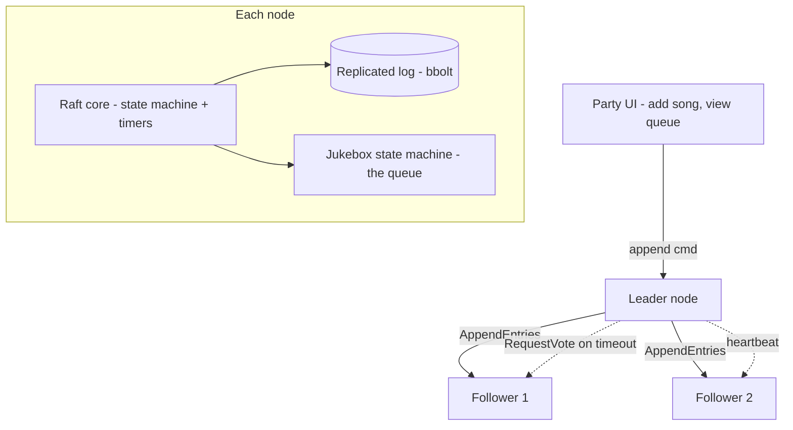

# P2 — JamRaft: a crash-proof collaborative party jukebox

> Highest prestige, broadest fit. A from-scratch Raft implementation is the gold-standard solo systems project.

## 1. What it is

JamRaft is a shared music queue for a party, run by a small **cluster** of nodes (your laptop, a friend's laptop, a Raspberry Pi). Everyone adds songs from a phone; the cluster must agree on the **exact play order**, and — the fun part — if the node currently "hosting" the party dies mid-song, playback continues in the agreed order with **no lost, duplicated, or reordered songs**. Kill any node, restart it, unplug the network between them: the queue stays consistent.

Under the hood, "agree on the play order across crashing nodes" is **distributed consensus**. You implement the **Raft** algorithm from scratch. The jukebox is a delightful shell over exactly the primitives that big-tech and infra interviewers probe: leader election, log replication, persistence, snapshots, and behavior under partition.

## 2. What you'll demonstrate

- **Consensus from first principles** (Raft): leader election, log replication, commit rules, safety.
- **Persistence & crash recovery** — a durable replicated log; nodes recover correctly.
- **Snapshotting / log compaction** — bounded state, fast catch-up.
- **Linearizability** — reads never show stale/forked state.
- **Distributed-systems testing** — a Jepsen-style fault injector proving correctness under partitions and crashes.

Big-tech new-grad guidance repeatedly names a from-scratch Raft KV store as the single most impressive systems project. JamRaft is that, with a memorable story.

## 3. Tech stack (and why)

- **Go 1.22** (recommended) — goroutines + channels model Raft's concurrent timers and RPCs cleanly; it's the language of etcd/Consul/Kubernetes, so it reads as "infra engineer." (C++ or Rust are fine alternatives if you want to double down on systems.)
- **gRPC** — for inter-node RPCs (`RequestVote`, `AppendEntries`, `InstallSnapshot`). Clean, typed, streaming-capable.
- **BoltDB / bbolt** (or a simple append-only file) — durable storage for the log + Raft state (currentTerm, votedFor).
- **A tiny web UI** (plain HTML + fetch, or a small React app) — add songs, watch the queue, see which node is leader; a "kill node" button for demos.
- **Docker Compose** — run a 3- or 5-node cluster locally.
- **Go's `testing` + a deterministic network simulator** for the chaos harness.

> Deliberately avoid using an existing Raft library — implementing it yourself is the entire point.

## 4. Architecture



**Layers inside each node:**

1. **Transport** — gRPC server/clients for the three RPCs.
2. **Raft core** — the consensus module: role (follower/candidate/leader), election + heartbeat timers, log, term, commit index, and the RPC handlers.
3. **Log store** — durable `currentTerm`, `votedFor`, and log entries; must survive restarts.
4. **State machine** — the jukebox: applies committed commands (`enqueue`, `dequeue/play-next`, `vote-skip`, `reorder`) to produce the current queue.
5. **Client session layer** — routes writes to the leader, redirects on leader change, dedups client requests.

## 5. Data model / RPCs

**Log entry:** `{ term, index, command }` where command is a jukebox op, e.g. `{"op":"enqueue","song":"...","clientId":"...","seq":42}`.

**Persistent per-node state:** `currentTerm`, `votedFor`, `log[]`, plus latest `snapshot`.

**RPCs (Raft paper):**

- `RequestVote(term, candidateId, lastLogIndex, lastLogTerm) -> (term, voteGranted)`
- `AppendEntries(term, leaderId, prevLogIndex, prevLogTerm, entries[], leaderCommit) -> (term, success)` — also the heartbeat when `entries` is empty.
- `InstallSnapshot(term, leaderId, lastIncludedIndex, lastIncludedTerm, data) -> (term)`

## 6. Implementation plan (milestones)

Follow the Raft paper's figure 2 exactly — it's a checklist.

**M1 — Single-node state machine + log.** Build the jukebox state machine and a durable log. `enqueue`/`play-next` work locally; state survives a restart by replaying the log. No consensus yet.

**M2 — Leader election.** Implement roles, randomized election timeouts, and `RequestVote`. Bring up 3 nodes; verify exactly one leader is elected, and that killing the leader triggers a new election. Log elections so you can watch them.

**M3 — Log replication.** Implement `AppendEntries`, `nextIndex`/`matchIndex`, commit-index advancement (a majority replicated -> committed -> apply to state machine). Now `enqueue` on the leader replicates to followers and the queue is consistent across nodes.

**M4 — Persistence & safety.** Persist `currentTerm`, `votedFor`, and log before responding to RPCs. Implement the election-restriction and commit rules so a stale leader can't overwrite committed entries. Test restarts.

**M5 — Snapshotting.** When the log grows, snapshot the queue state, truncate the log, and implement `InstallSnapshot` so a lagging/new follower catches up fast.

**M6 — Linearizable reads + client sessions.** For "what's playing / what's next," use the read-index approach (leader confirms it's still leader via a heartbeat round before serving) or leader leases. Clients attach `(clientId, seq)` so a retried `enqueue` isn't applied twice.

**M7 — Chaos harness + UI polish.** See testing. Add the "kill node" demo button and a live leader indicator.

**M8 (stretch) — Membership changes.** Single-server add/remove (joint consensus is the advanced version).

## 7. The hard parts, explained

- **Randomized election timeouts** (e.g., 150–300 ms) prevent split votes — every node picks a different timeout so they don't all become candidates at once.
- **Commit rule subtlety:** a leader may only mark entries from **its own term** as committed by counting replicas; entries from prior terms get committed indirectly once a current-term entry commits. Skipping this causes a classic safety bug.
- **`prevLogIndex`/`prevLogTerm` consistency check** in `AppendEntries` is what forces followers' logs to converge to the leader's; get the decrement-and-retry loop right.
- **Persist before you reply.** If you grant a vote or append entries but crash before persisting, you can violate safety on restart. Order matters.
- **Linearizable reads are not free:** serving a read from a leader that was just deposed (network partition) returns stale data. The read-index/lease dance is what prevents it.

Keep a written "why" for each of these in your README — interviewers love that you know the traps.

## 8. Testing & correctness

- **Unit tests** for election, replication, and log-consistency edge cases.
- **Deterministic network simulator**: an in-process transport where you control message delivery, delay, drop, and reorder — so tests are reproducible.
- **Jepsen-style chaos suite** (the headline): run randomized histories of client ops while injecting
  - leader kills mid-command,
  - network partitions (isolate the leader; verify a new leader forms and the old one steps down),
  - message drops/duplication/reordering,
  - node restarts.
  Record the operation history and check it for **linearizability** (a simple checker for a queue is tractable; or use Porcupine, a Go linearizability checker).
- **Recovery tests**: kill all nodes, restart, verify the committed queue is intact.

## 9. Benchmarking & metrics

- **Leader re-election time** after a leader kill (target: under ~1s; music resumes seamlessly).
- **Command throughput** (enqueues/sec) at cluster size 3 and 5.
- **Linearizable vs. stale read latency** comparison.
- **Zero linearizability violations** across N randomized fault histories (report N — e.g., 500).

## 10. How to run

```bash
docker compose up            # brings up node0, node1, node2
open http://localhost:8080   # the party UI
# demo: click "kill leader" and watch playback continue + a new leader appear
go test ./...                # unit + simulator tests
go test ./chaos -run Jepsen  # the fault-injection suite
```

## 11. Suggested repo structure

```
jamraft/
  cmd/node/main.go
  internal/
    raft/           # core: state, timers, RPC handlers (the heart of the project)
    transport/      # gRPC + the in-process simulator for tests
    store/          # durable log + snapshot (bbolt)
    jukebox/        # the state machine (queue ops)
    client/         # leader-aware client with (clientId, seq) dedup
  web/              # party UI
  chaos/            # Jepsen-style harness + linearizability checker
  proto/raft.proto
  docker-compose.yml
  README.md         # architecture, the safety rules, and how you proved linearizability
```

## 12. Stretch goals

- **Sharded queues** (one Raft group per room) with a config service.
- **Pre-vote** and **leadership transfer** extensions.
- Swap the jukebox state machine for a **generic KV store** to show the same core powers different apps.
- A **writeup** comparing your implementation to etcd's Raft.

## Resume bullets (tune with your real numbers)

- Built **JamRaft**, a crash-tolerant collaborative jukebox backed by a **from-scratch Raft** implementation (**Go**, **gRPC**) with leader election, log replication, persistence, and **snapshotting**, resuming the shared queue in **under 1s** after killing the leader node.
- Verified **linearizability** with a **Jepsen-style chaos harness** (network partitions, node crashes, message drops/reorders) across **500+** randomized histories with **zero violations**.
