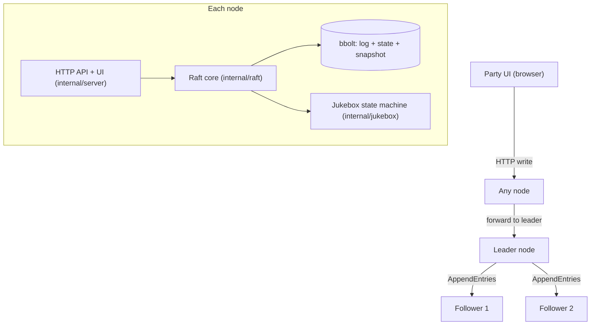

# JamRaft — a crash-proof collaborative party jukebox

[](https://github.com/RakMan09/jamraft/actions/workflows/ci.yml)

JamRaft is a shared party music queue run by a small **cluster** of nodes. Everyone
adds songs; the cluster agrees on the **exact play order**; and if the node
"hosting" the party dies mid-song, playback continues in the agreed order with
**no lost, duplicated, or reordered songs**. Kill any node, restart it, or
partition the network between them — the queue stays consistent.

Under the hood, "agree on the play order across crashing nodes" is
**distributed consensus**. The [Raft algorithm](https://raft.github.io/raft.pdf)
is implemented here **from scratch** (no external Raft library): leader election,
log replication, persistence, snapshotting, linearizable reads, and pre-vote —
verified by a Jepsen-style fault-injection harness.

## Live demo (runs in your browser)

The Raft core is compiled to **WebAssembly**, so an entire cluster runs live in a
browser tab — no backend required. Kill nodes, isolate them (simulated network
partition), or crank up the message-drop rate, and watch a new leader get
elected while the queue stays consistent. **It is the actual `internal/raft` code
running**, not a mockup.

Live: **https://rakman09.github.io/jamraft/** (after enabling Pages — see below).

Run it locally:

```bash
./scripts/build-wasm.sh
cd demo && python3 -m http.server 8000   # open http://localhost:8000
```

Publish it (free, always-on) via GitHub Pages: in the repo, go to
**Settings -> Pages -> Source: "GitHub Actions"**. The
[`pages.yml`](.github/workflows/pages.yml) workflow then builds the WASM and
deploys `demo/` on every push to `main`.

## What's implemented

| Area | Where |
| --- | --- |
| Raft core (roles, timers, RPC handlers, commit rules) | [`internal/raft`](internal/raft) |
| Leader election + **pre-vote** (no disruption on restart) | [`internal/raft/election.go`](internal/raft/election.go) |
| Log replication + consistency check + commit rule | [`internal/raft/replication.go`](internal/raft/replication.go) |
| Snapshotting / log compaction + `InstallSnapshot` | [`internal/raft/snapshot.go`](internal/raft/snapshot.go) |
| Linearizable reads (read-index) | [`internal/raft/readindex.go`](internal/raft/readindex.go) |
| Durable storage (bbolt + in-memory) | [`internal/store`](internal/store) |
| gRPC transport + deterministic simulator | [`internal/transport`](internal/transport) |
| Jukebox state machine (queue ops, exactly-once) | [`internal/jukebox`](internal/jukebox) |
| Leader-aware client with `(clientId, seq)` dedup | [`internal/client`](internal/client) |
| HTTP API + embedded party UI | [`internal/server`](internal/server), [`web`](web) |
| Jepsen-style chaos harness + Porcupine checker | [`chaos`](chaos) |

## Proof it works

Correctness here is *checkable*, not just claimed. Pick whichever level of rigor
you want:

**1. One command (reproduce everything, ~1-2 min):**

```bash
./scripts/verify.sh
```

It builds (native + WebAssembly), runs the full test suite, and runs a batch of
randomized fault-injected histories checked for linearizability. `HISTORIES=500
./scripts/verify.sh` runs the heavier batch.

**2. Continuous integration.** Every push runs the tests + a chaos batch via
[GitHub Actions](.github/workflows/ci.yml) — see the CI badge above and the live
logs in the Actions tab.

**3. Named tests for each Raft property** (`go test ./... -v`):

| Property | Test |
| --- | --- |
| A single leader is elected | `TestLeaderElection` |
| A new leader takes over when the leader crashes | `TestReElectionAfterLeaderCrash` |
| Committed data survives a leader change | `TestCommitSurvivesLeaderChange` |
| All nodes converge to the same log | `TestLogReplicationConverges` |
| State survives restart (replayed from disk) | `TestSingleNodeRestartReplaysLog` |
| Kill-all then restart keeps the queue | `TestFullClusterRecovery` |
| Snapshots compact the log | `TestSnapshotCompactsLog` |
| A lagging node catches up via snapshot | `TestInstallSnapshotCatchesUpLaggingFollower` |
| A partitioned leader refuses stale reads | `TestIsolatedLeaderCannotServeStaleRead` |
| Retried requests apply exactly once | `TestExactlyOnceEnqueue` |
| No linearizability violations under faults | `TestJepsen` |

**4. The headline result.** `go run ./cmd/chaos -histories 500` ran **500
randomized fault-injected histories (25,000 operations)** — crashing leaders,
partitioning nodes, dropping messages, restarting nodes — and a
[Porcupine](https://github.com/anishathalye/porcupine) linearizability checker
found **0 violations and 0 indeterminate results**:

```
=== JamRaft chaos report ===
histories:      500
cluster:        5 nodes, 2 clients x 25 ops
total ops:      25000
linearizable:   500 (Ok)
VIOLATIONS:     0
```

**5. See it live.** Open the [browser demo](#live-demo-runs-in-your-browser), or
run a real cluster (`./scripts/run-local.sh`) and kill the leader. A captured run
of exactly that (leader `n0` at term 1 killed; `n1` elected at term 2; queue
untouched):

```
=== BEFORE ===   node n0: role=leader term=1   queue=[Song A, Song B]
=== KILL LEADER n0 ===   {"status":"shutting down"}
=== AFTER  ===   node n1: role=leader term=2   queue=[Song A, Song B]   # intact
```

## Architecture



Layers inside each node:

1. **Transport** — gRPC server/clients for the three RPCs (`RequestVote`,
   `AppendEntries`, `InstallSnapshot`), plus an in-process simulator for tests.
2. **Raft core** — role, election/heartbeat timers, log, term, commit index,
   and the RPC handlers.
3. **Log store** — durable `currentTerm`, `votedFor`, log entries, and the
   latest snapshot; survives restarts.
4. **State machine** — the jukebox: applies committed commands (`enqueue`,
   `play-next`, `vote-skip`, `reorder`).
5. **Client session layer** — routes writes to the leader, forwards on leader
   change, and de-duplicates client requests exactly once.

## How to run

### Local (no Docker)

```bash
./scripts/run-local.sh          # builds and starts a 3-node cluster
open http://localhost:8080      # the party UI
# demo: click "Kill this node" on the leader and watch playback continue
```

### Docker Compose

```bash
docker compose up --build       # brings up node0, node1, node2
open http://localhost:8080
```

### Tests

```bash
go test ./...                   # unit + simulator tests (race-clean)
go test ./chaos -run Jepsen     # the fault-injection suite
go run ./cmd/chaos -histories 500   # many randomized histories + report
```

## The hard parts (and how JamRaft handles them)

These are the classic Raft traps — the ones interviewers probe. Each has a
short "why" so the reasoning is explicit.

- **Randomized election timeouts (150–300 ms)** prevent split votes: every node
  picks a different timeout, so they don't all become candidates at once. See
  `resetElectionDeadline` in [`internal/raft/node.go`](internal/raft/node.go).

- **Commit rule subtlety.** A leader may only mark entries **from its own term**
  as committed by counting replicas; entries from prior terms are committed
  indirectly once a current-term entry commits. Skipping this causes a classic
  safety bug (Raft §5.4.2). JamRaft appends a no-op on election and only counts
  current-term entries in `advanceCommitLocked`
  ([`internal/raft/replication.go`](internal/raft/replication.go)).

- **`prevLogIndex`/`prevLogTerm` consistency check.** This is what forces a
  follower's log to converge to the leader's. On rejection the follower returns
  a conflict hint and the leader backs `nextIndex` up (faster than
  decrement-by-one). See `AppendEntries` and `nextIndexAfterConflict`.

- **Persist before you reply.** If a node grants a vote or appends entries but
  crashes before persisting, it can violate safety on restart. JamRaft persists
  `currentTerm`/`votedFor`/log via the `store.Storage` interface **before**
  returning from the RPC handlers (`persistHardState`, `persistAppend`).

- **Linearizable reads are not free.** Serving a read from a leader that was just
  deposed (network partition) returns stale data. JamRaft uses the **read-index**
  approach: it records the commit index, confirms leadership with a heartbeat
  round to a majority, then waits for the state machine to catch up before
  answering ([`internal/raft/readindex.go`](internal/raft/readindex.go)). An
  isolated leader cannot get a quorum, so it fails the read rather than lying.

- **Disruptive restarts (pre-vote).** A node that restarts or rejoins with a
  stale log would otherwise repeatedly bump its term and force a live leader to
  step down. JamRaft runs a **pre-vote** round first (no term bump) and grants
  pre-votes only when no leader has been heard from recently, so a rejoining
  node cannot disrupt a healthy cluster
  ([`internal/raft/election.go`](internal/raft/election.go)).

- **Exactly-once client ops.** Each request carries `(clientId, seq)`. The state
  machine caches the last result per client, so a retried `enqueue`/`play-next`
  (e.g., after a leader change) is applied at most once
  ([`internal/jukebox/jukebox.go`](internal/jukebox/jukebox.go)).

## Testing & correctness

- **Unit tests** cover election, re-election after leader crash, replication
  convergence, restart recovery, snapshot catch-up via `InstallSnapshot`,
  linearizable reads under partition, and exactly-once semantics.
- **Deterministic network simulator** ([`internal/transport/sim.go`](internal/transport/sim.go))
  controls message delay, drop, duplication, and partitions, so tests are
  reproducible from a seed.
- **Jepsen-style chaos suite** ([`chaos`](chaos)) runs randomized client
  histories while injecting leader kills, minority partitions, message drops,
  and node restarts. Each history is checked for **linearizability** against a
  queue model using [Porcupine](https://github.com/anishathalye/porcupine).
- **Recovery tests** kill all nodes, restart them, and verify the committed
  queue is intact.

**Verified:** `go run ./cmd/chaos -histories 500` was run over **500 randomized
fault-injected histories (25,000 operations)** with **0 linearizability
violations** and 0 indeterminate results.

## Data model / RPCs

**Log entry:** `{ term, index, command }`, where `command` is a JSON jukebox op,
e.g. `{"op":"enqueue","song":{...},"clientId":"c1","seq":42}`.

**Persistent per-node state:** `currentTerm`, `votedFor`, `log[]`, latest
`snapshot`.

**RPCs** (see [`proto/raft.proto`](proto/raft.proto)):

- `RequestVote(term, candidateId, lastLogIndex, lastLogTerm, preVote) -> (term, voteGranted)`
- `AppendEntries(term, leaderId, prevLogIndex, prevLogTerm, entries[], leaderCommit) -> (term, success, conflictIndex, conflictTerm)`
- `InstallSnapshot(term, leaderId, lastIncludedIndex, lastIncludedTerm, data) -> (term)`

## Repo structure

```
jamraft/
  cmd/node/       # the node binary (Raft + gRPC + HTTP + UI)
  cmd/chaos/      # standalone chaos runner (N histories + report)
  internal/
    raft/         # core: state, timers, RPC handlers (the heart)
    transport/    # gRPC + in-process deterministic simulator
    store/        # durable log + snapshot (bbolt) + in-memory
    jukebox/      # the state machine (queue ops)
    client/       # leader-aware client with (clientId, seq) dedup
    server/       # HTTP API + client session layer
    cluster/      # test/chaos harness wiring
  web/            # embedded party UI
  chaos/          # Jepsen-style harness + linearizability model
  proto/          # raft.proto + generated stubs
  docker-compose.yml
```

## Regenerating gRPC stubs

Generated stubs are committed, so a normal build needs no `protoc`. To
regenerate after editing [`proto/raft.proto`](proto/raft.proto):

```bash
protoc --go_out=. --go_opt=module=github.com/rakman09/jamraft \
       --go-grpc_out=. --go-grpc_opt=module=github.com/rakman09/jamraft \
       proto/raft.proto
```
